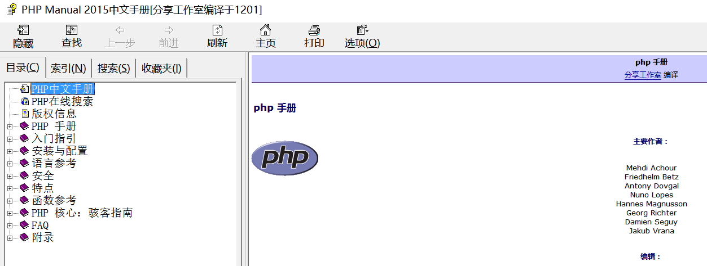
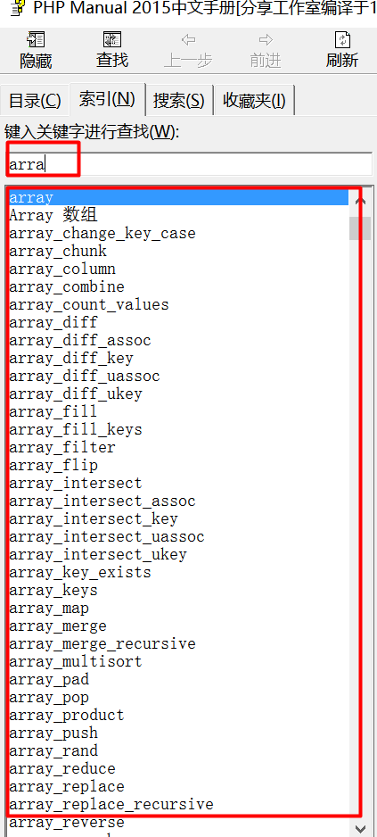
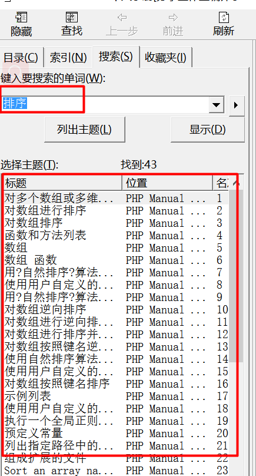
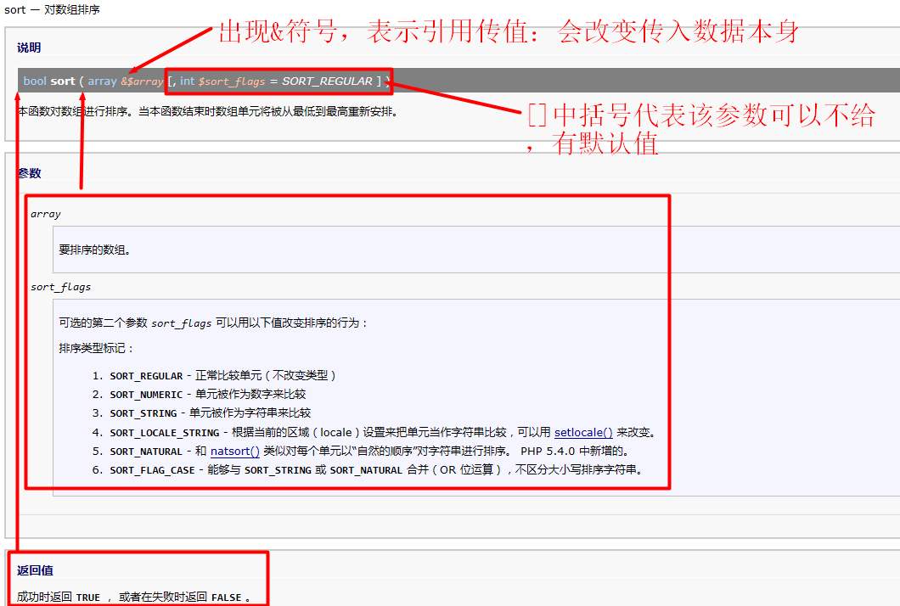

# **PHP函数**

> **思考**：在开发过程中会有很多代码其实是重复的，只是其中有一点点数据的变化，那么这样的代码我们是通过复制-粘贴-修改部分的方式来实现吗？

> **引入**：通过复制-粘贴-修改，的确能够达到实现很多代码重复利用的可能，但是这种形式莫过于臃肿，而且在后期维护的时候，如果有一点逻辑的修改，就需要修改所有使用了重复代码的地方，这样的操作太过繁琐。所以PHP提供了一种能够让代码重复利用变得简单便捷的方式，那就是函数。

## **函数概念【掌握】**
> **定义**：PHP中函数其实是一个具有复杂逻辑的代码块，而这种代码块通常可以在很多地方重复使用。函数是使用了一种特殊的结构来将要重复使用的代码进行包裹，后期可以通过定义的函数名字来直接实现重复代码块的调用。

1.函数结构：函数是一种特殊的结构，包括多个要素：关键字function，自定义函数名，参数结构，函数体和返回值5部分。
* function关键字：PHP内置的一种关键字，用来申明结构的本质
* 自定义函数名：紧跟function关键字，是一种见名知意的字符串，由字母、数字和下划线组成，其中不能使用数字开头（和变量一样），不区分大小写
* 参数结构：是一种外部对函数内部数据进行调整的机制（数据输入），分为形参（定义结构时使用的参数）和实参（调用函数时传入的实际数据），可以没有参数
* 函数体：函数的核心逻辑部分，用来实现某个功能的具体代码，在函数体中可以写普通的业务逻辑实现代码
* 返回值：return + 数据，将函数得到的结果对外返回，谁调用返回给谁（数据输出），可以没有返回值，系统默认返回NULL	

2.函数基础语法
function 函数名(形参列表){    
　　//函数体    
　　return 返回值;    
} 
```PHP
<?php
//定义一个简单函数
function display(){
    //该函数没有参数
    echo 'hello world';
    //该函数没有返回值
}
?>
```   
3.函数调用：指的是通过找到函数对应的内存地址（函数名寻找），然后实现函数内部代码执行的过程。调用方式是通过函数名字+()的形式实现
```PHP
<?php
    //调用函数：函数名字必须能够找到函数定义的结构
    display();            //输出hello world
?>
```
4.函数内存原理
* 函数不会自动运行，必须通过调用才会执行函数内部的代码块
* 函数是一种结构，PHP会先编译结构加载到内存（代码段），然后才会从第一行开始执行代码（函数的定义与调用没有顺序关系：PHP特殊）    

```PHP
<?php
//先调用函数
display();                //可以调用（不建议）

//后定义函数
function display(){
    echo 'hello world';
}
?>
```
* 函数的调用是在栈中开辟内存运行
* 函数运行结束后，会自动释放函数所占用的所有内存（即函数内部的数据变量不能在函数外访问）

5.练习：定义一个函数实现九九乘法表的打印输出，然后调用函数

> **总结**：函数的目的是实现代码的复用（重复利用），能够帮助程序员快速实现迭代开发。

****

> **思考**：函数的结构是固定的，代码一旦写完，以后都是调用。那么如何保证函数能够根据用户的需求来产生实际所需的结果呢？

> **引入**：函数内部结构是固定的，只是表明函数要实现的功能以及具体实现的算法是固定的，但是就数据而言，可以通过外部传入来得到数据变化的目标。这种数据的传入称之为参数。

## **参数说明【掌握】**
> **定义**：函数的参数，是指函数在定义过程中所要考虑的外部数据的变化来影响最终结果而定义的虚拟变量（不代表任何真实数据：形参），以及实际调用过程中外部传入主导数据运行的实际数据（实参）

1.函数的参数分为两种：定义结构的时候虚拟的数据，叫做形式参数（形参），以及调用函数时传入的实际参数（实参）
```PHP
<?php
//定义一个函数：输出该数据的3次方
function cube($n){
    //$n是在函数定义时作为数据代表的一种虚拟形式（没有任何值）
    echo $n * $n * $n;
}

//调用函数
cube(5);        //125，5是真实参与运算的数据
cube(3);        //27
?>
```
2.函数形参与实参的关系和工作原理
* 形参：是一种形式，是用来保存函数调用时外部出来的实际数据在函数内部运行的变量
* 实参：是一种数据，可以是数据值也可以是变量代表的数据
* 工作原理：实参在函数调用时，将数据或者变量代表的数据传递给形参，而函数一旦运行结束，内部的形参所代表的实际数据就会消失

3.函数一定在定义时设定了形参，那么调用时就必须传入对应的实际参数，否则会报错；但是实参可以比形参多，系统会自动忽略（本质没有忽略，接收了但是不用而已）
```PHP
<?php
//定义一个函数：输出该数据的3次方
function cube($n){
    echo $n * $n * $n;
}

//调用函数
cube();            //错误：因为$n没有任何值，所以系统提示没有未定义变量$n   
cube(2,3,4);       //8，取第一个参数（因为只有一个形参） 
?>
```
4.练习：定义一个函数，能够实现不同层级的空心菱形的打印

> **总结**：参数是函数能够实现复用的重要因素，在定义一个可复用函数的时候，一定要考虑清楚，哪些内容是可以改变的，那么就需要为这类内容定义参数，通过外部调用控制来实现函数价值的更大化。

****

> **思考**：函数的参数在定义时规定好后，在调用时如果传入不够就会报错，但是在某些情况下，绝大部分的时候不是每次调用函数对应的参数都不同，那么这个时候有没有好的方式能够解决这个问题呢？

> **引入**：函数定义的参数目的就是为了方便调用时改变，如果某个数据其实很多时候是不需要改变的，那么可以采用参数的默认值来解决。

## **参数默认值**
> **定义**：参数默认值，即函数在定义的时候，发现有些数据是外部可变，但是不需要经常改变的数据的时候，可以对形参指定一个对应的数据，这样用户在调用的时候，即便不给对应的形参传递实参，形参也会有数据去支持函数运行。

1.函数参数默认值的指定方式就是在定义的时候给定默认值
```PHP
<?php
//定义函数：输出数值的平方
function square($n = 1){
    echo $n ** 2;        //**代表指数
}
?>
```
2.默认值的使用：如果在调用函数的时候指定了对应的参数，那么系统会使用用户传入的参数，如果用户没有传入参数，系统才会使用默认参数
```PHP
<?php
//调用
square(10);              //100
square();                //1，不会报错，正确执行：使用到了默认值

?>
```
3.默认值使用注意事项
* 函数形参可以没有默认值也可以有多个默认值
* 函数有默认值的参数必须定义在所有参数的最后（系统把实参传递给形参是按顺序给） 

4.练习：定义一个函数输出指定位置的实际斐波那契数据值，如第4个是5，给定默认值为第10个

> **总结**：默认值是一种给用户提供方便的参数方式，合理的使用默认值可以节省一些调用层面的操作。

****

> **思考**：实参给形参赋值的时候会不会改变实参本身的数据？

> **引入**：实参给形参赋值的时候，默认是采用变量的值传递方式，也就是说是把实参的值给形参（新的变量同样的值），在函数内部运行的是形参变量代表的数据，不会改变外部实参的数据，但是也可以采用引用传递（传址）来让形参和实参共用一块内存地址，从而实现内部改变外部。

## **参数传值方式【了解】**
> **定义**：参数传值是指函数在调用时，实参到底是如何传递给形参的，他们之间的传值方式是在函数定义时决定的，传值方式就是变量的传值方式。默认的传值方式是值传递。

1.函数参数传值方式：值传递，就是将变量的值传递给形参，从而是两个不同变量；引用传值，就是将实参的内存地址传递给形参，两个变量指向同一个地址。
```PHP
<?php
function changeValue($a,&$b){
    //&就是地址符号，表示获取的是外部参数的地址
    $a++;
    $b++;
}

$a = 10;                //注意：形参的名字与外部定义的变量名字没有冲突关系，只是“恰巧”同名而已
$b = 10;
changeValue($a,$b);    
echo $a;                //10，值传递，所以不改变外部变量本身
echo $b;                //11，引用传递，所以内部修改影响外部变量
?>
```

> **总结**：参数传值方式默认是值传递，在实际开发中，基本上都是值传递。引用传递可以在某些特定情况下使用，通常比较底层的开发使用的比较多。

****

> **思考**：函数是一种结构，那么这种结构内部可以做什么呢？还是什么都能做？

> **引入**：函数的目的是什么？是为了实现某一个功能定义的代码块，而且能够实现复用。所以在函数内部去使用一些解决业务逻辑的代码都是可行的。

## **函数体【了解】**
> **定义**：函数体就是在函数结构{}所包含的所有代码，包括业务逻辑实现代码和返回值代码。

1.函数体中可以使用的代码或者结构
* 函数体中可以定义变量保存数据
* 函数体中可以使用分支结构进行逻辑判断
* 函数体中可以使用循环实现数据迭代
* 函数体中可以调用函数（与外部调用方式一样）
* 函数体中可以定义函数（匿名函数）
* 函数体中可以调用类（高级）    

2.函数体要做什么：函数的本质是要为了解决某个特定的问题而生，所以函数内部的代码要实现的功能就是解决一个问题（通常不要太大），每个问题都应该有对应的函数来解决。大问题是通过调用小问题解决方案（函数）来实现解决的，这样能够最大的实现代码的复用。

> **总结**：函数体是为了解决某个特定的小功能的，因此一个功能应该有一个对应的函数，尽量不要让函数太大，每个函数都可以独立解决某个问题就好。

****

> **思考**：函数为了解决某个问题写了很多代码，外部调用函数即可，但是外部如何知道函数是不是真正解决了问题呢？

> **引入**：函数通常都是用来运算得出一个解决（不局限于数学运算），函数不对结果负责，只做专业的事情，所以函数会把执行的结果返回给使用者，使用者再去根据结果来进行其他逻辑判定。这就是函数返回值。

## **函数返回值【掌握】**
> **定义**：函数返回值是函数内部运算的结果，根据实际每个函数的功能而定的，但是返回方式都一样，就是使用return + 结果的形式。函数可以没有返回值，是因为函数默认返回NULL。

1.函数一定有返回值：如果用户指定就会返回指定结果，否则返回NULL
```PHP
<?php
function display(){
    echo 'hello world';    //该函数目标是数据输出，所以不需要返回值
}
var_dump(display());       //NULL，说明函数最终还是返回了结果NULL

function getBack(){
    return 100;
}
var_dump(getBack());       //100
?>
```
2.接收返回值：返回值是返回到函数调用出，因此可以通过变量来接收函数的返回值
```PHP
<?php
functiton getBack(){
    return 100;
}

//接收返回值
$res = getBack();
echo $res;                 //100
?>
```
3.return关键字功能：return虽然在函数中使用的多，但是它拥有多个功能
* 在函数内部使用return + 数据，可以返回数据结果
* 在函数内部使用return代表函数体执行到这行结束（如果后面还有代码都不再执行）
* return可以代表文档返回值（这个在文件包含的时候才讲）

4.练习：定义函数求出1到100以内的所有质数，并以数组形式返回

> **总结**：函数返回值属于函数的重要组成部分，绝大部分的函数都应该有返回值，但是通常不会在函数内部替外部做决定，只是负责求出目标结果。return关键字在函数内代表着函数结束，也代表着数据的返回。

****

> **思考**：函数随着return出现或者函数体运行完就会自动结束，内部的所有数据都会清空，函数即便调用N次都会是一样的效果，如果想实现函数同一个函数多次调用都能够共用一些数据的话，该怎么实现呢？

> **引入**：函数是个独立的运行体，其所占内存控制只在函数运行期有效（即函数调用开始到函数运行结束）。如果想要数据能够在函数多次调用都有共用的话，函数也提供了一种解决方案，就是静态变量。

## **静态变量【掌握】**
> **定义**：静态变量，即在函数内部使用static关键字修饰的变量，这种变量是在函数第一次调用时执行，而且只执行一次，在函数再次调用时，会自动跳过这一行（不会再次执行）。这种变量能够在同一个函数多次调用共享数据的变化。

1.基本语法：使用static关键字修饰变量，通常静态变量都会在定义的时候进行初始化（即给定值）
```PHP
<?php
function getStatic(){
    static $c = 0;        //静态变量
    $var = 0;             //普通变量
}
?>
```
2.静态变量与函数内定义的普通变量的区别在于，初始化那行只会执行一次
```PHP
<?php
function getStatic(){
    static $c = 0;        //静态变量
    $var = 0;             //普通变量
    
    //自增输出
    echo $c++,$var++;
}

//调用
getStatic();               //0,0：第一次调用，$c初始化，两个都是0开始，输出后都变成1
getStatic();               //1,0：第二次调用，$c不再初始化，所以是1，而$var继续初始化为0，所以最终输出变成1,0，$c变2
?>
```
3.静态变量的作用范围：虽然静态变量允许跨函数共享数据，但是静态变量只允许在当前函数内部使用，其他任何地方都用不了    
4.练习：制作一个函数计数器，每次函数调用时，都提示当前函数是第几次被调用

> **总结**：静态变量是函数内部的一种特殊变量，它允许同一个函数多次调用时实现数据共享，但是又规定只能在函数内部使用。

****

> **思考**：函数外部定义好的变量，为什么还要通过参数传到函数里面去使用呢？

> **引入**：在PHP中，任何变量都是有其有效的边界的，我们把这种PHP变量能够工作的边界叫做作用域

## **作用域【掌握】**
> **定义**：作用域（scope），指的是变量所定义的环境决定的能够被访问的工作区域。在PHP中变量的作用域分为三种：全局作用域、局部作用域和超全局作用域

1.**全局作用域**：用户自定义全局变量，但是是在函数外部定义的变量。全局作用域的变量能够在**函数外部**的任何地方使用，其生命周期是**从定义直到脚本执行结束**（手动释放除外）    
2.**局部作用域**：用户在函数内部定义的局部变量。局部变量只能在**函数内部**访问，函数外部不能够访问，其生命周期是**函数运行时**    
3.**超全局作用域**：能够在PHP脚本的任何地方使用，包括函数内部（以后还包含在类内部）。是系统定义的超全局变量，生命周期是脚本周期
```PHP
<?php
//作用域
$a = 100;             //全局变量，在全局作用域中访问
$_GET['age'] = 1;     //超全局变量：借助系统变量$_GET 

function display(){
    $b = 50;          //局部变量，只能在局部作用域访问（函数自身内部）
    //echo $a;        //错误：系统提示该变量未定义
    echo $_GET['age'];//1：能够访问
}

//echo $b;            //错误，系统提示该变量未定义
echo $_GET['age'];    //1，能够访问
?>
```
4.作用域的划分是为了更好的管理变量的访问，如果想要在局部作用域（函数内部）访问全局变量的解决方案如下：
* 所有用户定义的全局变量都会放到$GLOBALS中，而$GLOBALS是一个超全局变量，可以在任意地方访问

```PHP
<?php
$global = '全局变量';

function getGlobal(){
    //echo $global;            //错误：直接访问不了，提示未定义变量
    echo $GLBOALS['global'];   //全局变量：使用超全局变量可以访问所有全局变量
}
?>
```
* 可以通过函数的参数将外部变量传递到函数内部，如果想要函数内部访问且改变的话，可以采用引用传值

```PHP
<?php
$global = '全局变量';

function getGlobal(&$out){        //引用传值
    echo $out;
    $out = '局部变量';             //修改引用传值进来的变量，即修改外部变量
}

echo $global;                      //全局变量
getGlobal($global);                //全局变量
echo $global;                      //局部变量：被函数内部修改过
?>
```
* 可以使用global关键字在函数内部进行引入：global关键字是一个全局引用/定义变量，如果是引入全局变量，必须使用global定义一个外部同名变量（global只能声明变量，不能赋值）

```PHP
<?php
$out = '全局变量';

function getOut(){
    //声明全局变量
    global $out;                    //不能赋值
    echo $out;                      //全局变量
    $out = '局部变量';
}

echo $out;                          //全局变量
getOut();                           //全局变量
echo $out;                          //局部变量
?>
```
5.如果函数内部定义的局部变量想在外部全局作用域访问，解决方案如下：
* 引用传值：内部能访问外部，固然外部也能访问内部
* 使用global关键字：global关键字的特性是如果全局作用域存在同名变量，则引入；否则创建一个对应的全局变量

```PHP
<?php
function getIn(){
    //声明全局变量
    global $out;
    $out = 'out';
    $in = 'in';                    //局部变量
}

//echo $out;                       //错误：未定义变量（函数没有执行过）
getIn();
echo $out;                         //out
?>
```

> **总结**：在PHP中作用域的划分是很清晰的，外部定义的默认只能外部访问（全局），内部定义的就内部访问（局部），系统定义的就随便访问（超全局）。通常我们不会特别的去跨作用域访问用户自定义变量，但是系统变量一定会到处使用的。

**** 

> **思考**：前面学过数据类型，数据类型是进行数据操作的基础，我们不应该相信任何外来数据，那么函数内部如何确定外部数据一定是需要的类型的呢？

> **引入**：PHP是一种弱类型语言，因此在函数真实业务逻辑开发的时候，如果调用函数所传递的数据无法确保是确定的类型（程序员调用时明确数据是函数能够接受的类型除外），那么在函数内部的确需要进行数据的判定以保证数据是安全可靠可操作的（当然，数据类型的自动转换会帮助代码在执行时不会出大错）。而实际上PHP7中也提供了一种强制类型的限定，来保证程序拿到的数据是有效的。

## **PHP强制类型【了解】**
> **定义**：强制类型，顾名思义，就是在数据进行操作前就明确数据必须是某种指定的格式，一旦格式不符合，那么系统就会报错。PHP7中针对函数的强制类型分为两种：强类型参数和强类型返回值。

1.强类型参数：就是在定义函数给定形参的时候，根据函数功能的需求，强制要求参数是对应的类型
```PHP
<?php
function get1($a,$b){
    return $a + $b;        //$a和$b应该是数值，但是实际调用时可以传入字符串
}
echo get1('a','1b');       //1，虽然系统会警告，但是系统也还是会自己处理结果

function get2(int $a,int $b){//定义时规定参数必须是整形
    return $a + $b;
}
echo get2('a','1b');        //致命错误：传入的类型与要求的类型不符

?>
```
2.强类型返回值：同样是在定义函数结构的时候指定返回值的类型
```PHP
<?php
function get1(int $a,int $b){
    return $a + $b;         //没有强调返回值：返回值类型根据$a + $b的结果而定，$a和$b是整形，所以返回值是整形
}
//强制返回值类型
function get2(int $a,int $b):float{    //此处指定返回值类型为float
    return $a + $b;
}

var_dump(get1(1,1));                    //(int)2
var_dump(get2(1,1));                    //(float)2
?>
```
3.通常在进行强制类型控制的时候，会在最上面（所有代码都没有写之前）顶格写上一行代码，表示后续使用强制类型。declare(strict_types = 1)，但是这句实际上实用价值不高，即便没有这句，声明的强制类型依然有效。（官方给出的解释是能够节省运行时间，但是没有实际的效率说明）
```PHP
<?php
//使用强制类型
declare(strict_types = 1);
//定义函数
?>
```

> **总结**：PHP7中强制类型的出现有利有弊，利在于明确类型可以提升PHP代码的运行效率；弊在于PHP本身是一种弱类型语言，强类型的加入会让很多程序员不习惯，且代码无法向下兼容（PHP7以前不支持强类型），而且PHP中本身内部有很强大的自动转换功能，就这个强类型本身而言不会出现太大性能提升（PHP中的强类型是在执行阶段，而不是在编译阶段）

****

> **思考**：有的时候，需要在函数内部调用函数的时候，无法明确知道外部会提供什么函数（尤其是调用系统函数的时候），而函数的调用又需要通过函数名来解决。这个时候该怎么办呢？

> **引入**：在PHP中，函数名字调用函数的目的是在于通过函数名去找到函数的内存地址，然后运行。也就是说，如果能够找到函数所在地址，就可以实现函数的运行。在实际开发当中，尤其是很多系统已经定义的函数里，通常会需要用户将自己定义的函数告知系统函数，然后系统函数去调用。那么这种实现的机制在PHP中用可变函数解决。

## **可变函数【了解】**
> **定义**：可变函数，并不是函数可以变化，而是函数的名字具有不确定性，是通过变量来保存函数名字，然后也是通过变量+()的方式来实现函数的访问。

1.基本语法
```PHP
<?php
//定义函数
function display(){
    echo 'hello world';
}

//定义一个变量：保存一个字符串与函数名同名
$var = 'display';
//使用可变函数访问函数
$var();            //display：$var代表的结果就是display，然后与()结合就是display()，所以运行display函数
?>
```
2.可变函数通常不是看到一个函数，然后刻意用变量去访问，而是在不确定函数名叫做什么的时候才用这种方式
```PHP
<?php
//定义一个函数：获取N的3次方
function cube($n){
    return $n ** 3;
}

//定义函数：函数内部需要通过调用一个外部的函数来辅助操作
function getCube($n,$func_name){
    //系统认定$func_name一定要是一个函数（回调函数）
    echo $func_name($n);        //调用外部函数，同时传入参数
}

getCube(10,'cube');             //1000，将cube这个外部函数名传入给一个函数，函数在内部调用cube（回调函数的原理就是如此）
?>
```

> **总结**：可变函数一般不会用，但是在一些大的函数（实现功能比较复杂，需要多个函数执行）或者系统函数或者对外提供接口时，会用到这个知识。

****

> **思考**：在开发过程中，是不是所有的功能都需要自己开发？有没有一些现成的函数呢？如果有该怎么去找到，以及怎么用呢？

> **引入**：一个成熟的编程语言，其强大之处无外乎两种：一是自己有强大的库，能够支持几乎各种业务开展；还有一种就是拥有强大的扩展，提供很多操作接口。PHP作为一种有资历、成熟且市场应用率极高的语言，这两种强大都有。

## **PHP常用系统函数【掌握】**
> **定义**：系统函数，即系统已经在开发的时候就考虑到一些常见的功能，并且系统开发者已经将这些通用的功能进行了函数封装，一般都会放到对应的操作手册中，并且告诉开发者怎么用。用户只需要在开发手册中找到这些函数就可以参照使用了。

1.操作手册一般是官方开发提供，提供了系统中的很多操作要素。函数作为其中一种常见的帮助，有很详细的讲解和使用。操作手册PHP格式较多的是chm文件。PHP操作手册的使用通常分为三种：明确寻找，半模糊匹配，功能检索 

    
* 明确寻找：指明确知道自己要找的是什么样的扩展里的函数，那么可以通过对应的“函数参考”来寻找，进入到对应的扩展功能分类中即可（这种通常是有一定熟练度）    

* 半模糊匹配：指通过索引功能，使用自己已经知道（或者猜测，如数组应该是array开头）部分开头或者分类的，但是不确定是不是有或者具体是哪个，可以输入部分，然后会自动匹配合适的，再去选择自己想要的即可（不能是中坚部分，一定要开头）    
    
* 功能检索：这个是完全不知道有没有或者什么开头，然后看看能不能匹配上。在搜索栏中输入自己想要功能的关键字（越准确越好，可以使用中文匹配：前提是中文操作手册）    

* 函数查看：查看函数的目的在于函数如何用，能够解决需要解决的问题。因此函数的查看主要看三部分：返回值，函数参数数量及其类型    


2.常见输出类：帮助程序员进行数据输出或者调试数据
* echo：一种语法结构，不是函数，不需要使用括号
* print_r：输出变量的结构，方便查看
* var_dump：也是一种语法结构，详细打印变量的结构和数据
* exit/die：输出消息并终止脚本执行

3.时间日期类：帮助程序员进行时间操作管理
* time：获取当前时间的时间戳（从格林威治时间1970年1月1日0点0分0秒开始）
* date：按照指定格式输出时间，可以是当前时间也可以是指定时间戳
* strtotime：将任何英文文本日期时间描述转换成时间戳
* microtime：获取时间戳和微妙数（精度高）

4.数学类：帮助程序员进行数学操作
* max：获取多个数中最大的（可以是数组）
* min：获取多个数中最小的（可以是数组）
* floor：舍去法取整（向下取整），获取不大于当前数值的最大整数
* ceil：进一取整（向上取整），获取不小于指定数值的最小整数
* mt_rand：获取指定区间或者0到最大数之间的一个随机整数
* round：根据指定的小数位进行四舍五入

5.字符串类：帮助程序员对字符串进行基本操作
* addslashes：对ASCII中的特殊字符进行转义，通常对用户输入的内容进行特殊处理
* htmlsmpecialchars：将HTML特殊符号转换成实体
* htmlspecialchars_decode：将实体符号转换成普通字符
* chr：将ASCII对应的数值转换成对应的符号
* ord：将ASCII字符转换成对应的数值
* explode：将字符串按照指定的符号分隔，得到一个数组
* implode：将一个数组按照指定的符号连接成一个字符串
* md5：使用md5算法对数据进行加密
* str_repeat：将字符串重复指定次数
* str_replace：字符串替换
* str_shuffle：随机打乱一个字符串
* str_split：按照指定长度将数组分割，返回数组
* strip_tags：去除HTML和PHP标记
* strlen：获取字符串的长度（字节长度）
* stripos/strpos：查找字符串中首次出现目标字符串的位置
* substr：从字符串中截取指定位置和长度的子字符串
* trim：去除字符串两边的空格（默认是空格，也可以是其他字符）
* ucfirst：将字符串首字母大写
* strtolower：将所有字母小写
* strtoupper：将所有字母大写
* strstr：获取字符串中某个字符首次出现到最后的字符串

6.数组函数：帮助程序员对数据进行操作
* array_key_exists：判断下标是否在数组中存在
* array_keys：获取数组全部下标，或某个确定值的下标
* array_merge：合并数组元素（相同字符串下标元素是覆盖）
* array_pop：从数组最后弹出一个元素（原数组元素减少）
* array_push：从数组最后加入一个元素（原数组元素增加）
* array_unshift：从数组最前面加入一个元素（原数组元素增加）
* array_shift：从数组最前面弹出一个元素（原数组元素减少）
* shuffle：将原始数组打乱
* in_array：判断元素是否在数组中存在
* range：生成一个规则数值数组
* current：获取当前数组指针所在位置的值
* next：将数组元素指针向后移动一位，并获取新元素的值
* prev：与next相反，向前移动
* end：指针移动到最后一个元素，并获取元素值
* reset：重置数组指针（回到第一个元素）
* list：语法结构，从数组中获取数据，并且将数据赋值给变量

