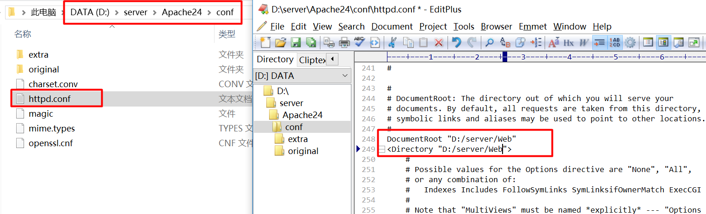
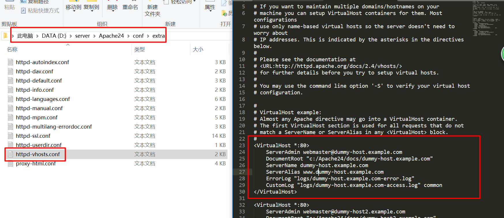

# **认识互联网**

> **思考**：平常我们上网的时候是怎么实现的？

> **引入**：上网其实打开浏览器，然后输入一个URL，最后就看到了网站打开的效果。


## **普通用户访问网站【了解】**
> **定义**：URL：Uniformed Resource Location，统一资源定位。是特指互联网上的一种绝对路径，一个URL通常包含几个部分：HTTP协议、主机名和URI。以http://www.taobao.com/index.html 为例。    
1.HTTP协议，HTTP协议是互联网上浏览器与服务器之间进行访问所规定数据交换规范，通常以http://开始    
2.主机名：即服务器网站的名字，可以通过主机名确定互联网上对应的某台提供服务的电脑（主机），通常是www.标志.com/cn，如www.taobao.com表示淘宝主机    
3.URI：Uniformed Resource Identifier，统一资源标志，是指服务器上对应要被访问的文件从网站根目录开始对应的路径，如果在根目录下的index.html就是/index.html

> **总结**：网站的访问对于用户而言非常简单，其实就是一个输入URL，然后其他的工作就是浏览器与互联网之间的操作，用户不需要管理，只管看到最后的结果。但是实际上一个简单的URL包含了很多信息。

****

> **思考**：一个真实的上网环境难道就是这么简单的吗？浏览器上输入一个URL看到的结果到底是怎么来的呢？

> **引入**：其实浏览器访问网站本身是一件很复杂的事情，需要通过网络、定位以及软件服务才最终呈现用户所看到的效果的。

## **网站访问实际流程【掌握】**
> **互联网访问定义**：互联网的中的网站访问，本质是一个互联网上有一台已知的服务器，然后用户知道服务器对应的“名字”（URL），然后通过URL，再经过互联网协议（HTTP协议）去自动寻找，并且服务器提供数据，浏览器解析数据的过程。

1.互联网基本知识
* 所有计算机在互联网上访问到的内容都是由相应的服务器提供资源
* 服务器的本质不是硬件，而是装有服务器软件的计算机
  * 装有服务器软件就可以对外提供对应服务
  * 一台计算机可以安装多种服务软件
* 所有计算机在互联网上都有一个唯一的标识代表自己：IP
  * IPV4是由32个比特位组成，转换成10进制分成4段，如112.90.32.8
  * IPV6是由128个比特位组成，转换成16进制分成8段，如31da:1d3:0:2f3b:2aa:ff:fe28:9c5a
  * 特殊IP：127.0.0.1代表本机电脑
* 任何软件都有属于自己的对外交流的入口：端口（Port），而任何客户机尝试访问服务器都需要指定访问的端口（常用的有默认）
  * Web服务器常用端口：80
  * Telnet远程登录端口：23
  * FTP服务器常用端口：21
  * Mysql数据库服务器常用端口：3306
* IP能够找到电脑，但是用户记不住，所以需要给IP设定一个别名方便用户记住，这种别名叫做域名（Domain Name）
  * 域名的存在纯粹是为了方便用户记住：www.baidu.com
  * 域名可以分为顶级/一级域名（.com/.cn/.org/edu），二级域名（baidu.com），三级域名（www.baidu.com）以此类推
* 域名是人为的不具有唯一性，要找到服务器只能通过IP，所以计算机需要将用户输入的域名转换成对应的IP地址才能找到服务器，这个过程叫做域名解析，提供该服务叫域名系统DNS（Domain Name System）
  * 提供服务的产品公司将域名和服务器IP维护到DNS上（收费）
  * 本地域名解析，可以使用计算机自带的本地域名系统hosts文件（C:\Windows\System32\drivers\etc\hosts）

2.互联网真实访问流程


> **总结**：互联网的访问站在用户角度操作简便，但是站在一个网站服务提供的角度，需要提供硬件、软件和协议的各种支持，最终才能实现数据的用户共享。

****

> **思考**：服务器的本质是为其他计算机提供服务，那么如何区分服务器呢？

> **引入**：服务器的区分是根据服务器安装的软件提供的服务类型来区分和命名的，当然也有根据服务器的硬件来区分专业和普通之说。


## **服务器分类【了解】**
> **定义**：服务器根据所安装的软件不同，分别对外提供不同的服务，根据日常所提供的服务的不同，我们就有了不同的服务器分类。    

1.**域控制器**-是用于内网中，担当域的用户、安全策略和文件/打印资源等方面的管理，通常是需要连接几十、几百、甚至上千个用户的并发连接。而且域控制器又是整个内间的核心所在，关系着整个公司网络的正常运行。这样一来，一是稳定性要求就非常高，白色支持长时间不间断运行;另一方面处理器性能、内存和网卡性能都要求非常高，只有这样才能支持这么多用户的并发连接。    
2.**文件服务器**-要求与域控制器的要求相似，只是在并发用户数支持方面要求稍低，因为并不是所有网络用户都会访问文件服务器的。但文件服务器是用来存储网络用户文件的，所以在硬件读写性能，以及硬盘容量方面的要求较域控制器更高，建议选择磁盘读写性能好的：SCSI、SATA、SAS 接口硬盘。正因如此，在文件服务器中通常是采取RAID5以上级别的硬盘阵列，一方面用于提高文件服务器的文件读写性能，另一方面也进一步提高文件服务器中的数据安全。    
3.**Web服务器**-主要特征是并发连接多(不仅是指并发用户，因为一个用户通常远不止打开一个网页，而每打开一个网页都是一个单独的连接)，另外，同样需要相当的稳定性。并发连接多的需求就要求服务器的硬盘读取性能，以及网卡的连接性能非常高，另外也要确保服务器处理器能力有足够的保障。    
4.**FTP 服务器**-性能需求与Web 服务器也类似，但FTP 服务器在并发连接方面要比Web 服务器要求稍低，但FTP 服务器一般都允许用户上传文件，所以FTP 服务器的硬件读写性能方面要求要比Web 服务器高，而且，所要求的硬盘容量也比Web 服务器大，也需要选择传输性能更好的SCSI、SATA 、SAS 接口硬盘。在网卡方面，尽管并发连接数通常不会如Web 服务器那么多，但FTP 服务器所进行的是文件传输，需要占用较大的带宽，特别是大容量;文件的上传和下载， 所以要求FTP 服务器的网卡连接性能也非常高。    
5.**邮件服务器**-就与FTP服务器比较相近，因为它们都需要允许用户的文件读写功能。在邮件服务器中，除了要为用户提供邮件接收功能外，还要为用户提供邮件发送的功能。一方面要求邮件服务器的硬盘容量比较大，另一方面也要求邮件服务榕的硬盘读写能力非常强。当然邮件服务器的网卡连接性能更是不可忽视的，否则邮件的接收和发送队列无法及时完成。    
6.**数据库服务器**-性能要求相对前面几种服务器来说就更加高了。因为数据库服务器在调用文件和程序时不像前面介绍的服务器那样是直接访问的，而是通过各种索引、条件比较、动态页面访问、页面提交等方式从分布在各数据文件中抽取的一些或全部字段，浓度更大，更需要消耗服务器的CPU 、内存和硬盘等资源。在CPU 的选择方面，目前的高高主频、多核、多线程处理器(如Intel 的双核、四核至强处理器，AMD 的双核、四核Opteron 处理器， IBM的四核 Powers 、双核Power币，以及Sun 的四核ULtraSPRC Tl 和八核ULtraSPRC T2 处理器等)是比较好的选择，内存通常是需要在8GB以上的。另外，数据库信息条数通常是几十、上百万级的，整个数据库存文件所需要占用的硬盘容量非常大。再加上数据库中的数据对于企业用户来说特别重要，所以对于数据库服务器的数据通常是采取像RAID5 以上级别的硬盘阵列技术来保障硬盘读写性能和数据安全的。所以数据库服务器的选择应该特别慎重考虑。当然，数据库服务器的网卡性能也不可忽视，否则即使数据库服务器本身性能非常商，终端用户仍无法及时得到正确的响应。    
7.**VoD 服务器**-强调的是实时性，而且所传输的是非常消耗资源的流媒体，从总体上来说，对服务器的要求堪与数据库服务器媲美。这一方面要求VoD 服务器的流媒体处理作能非常高，内存资源非常足，硬盘容量非常大，硬盘读取和稳定性能都非常高;另一方面要求VoD服务器的网络连接带宽足够宽，连接性能足够好。


> **Web服务器**：一般指**网站服务器**，是指驻留于因特网上某种类型计算机的程序，可以向浏览器等Web客户端提供文档，也可以放置网站文件，让全世界浏览；可以放置数据文件，让全世界下载。目前最主流的三个Web服务器是Apache Nginx IIS。服务器使用**HTTP**（超文本传输协议）与客户机浏览器进行信息交流，这就是人们常把它们称为**HTTP服务器**的原因。

》**总结**：服务器的分类非常简单，根据提供的服务区分即可。那么在接下来的学习过程中，我们主要是从事Web开发，因此需要对Web服务器进行深入了解。

****

> **思考**：Web也就是网站的访问就是之前所了解的网站访问流程那样简单吗？

> **引入**：之前所了解的Web访问流程确实就是Web服务的基本架构，这一点不会改变。但是随着用户需求的改变，随着服务质量的提升，Web的发展也是经历过阶段提升的。

## **Web发展史【掌握】**
> **定义**：Web的发展一共经历了两个阶段，俗称Web1.0和Web2.0，站在开发者和用户的角度来说就是静态网站和动态网站。

1. **Web 1.0**（信息共享） Web技术发展的第一个阶段就是静态技术阶段，在这个阶段，HTML语言就是Web向用户展示信息的最有效载体。在这个阶段，是以编辑为特征，网站提供给用户的内容是网站编辑处理后的，用户阅读网站提供的内容，这个过程是网站向用户的意向行为。


> **总结**：最开始在Web1.0时代，只需要一个Web服务器软件（Apache/Nginx/IIS）就可以实现网站服务。


2. **Web 2.0**（信息共建） web技术发展的第二个阶段是动态技术阶段，在Web 1.0时代，Web服务器会返回整个页面或者文档，但随着动态脚本语言的出现（ASP、JSP和PHP），使得用户可以在获取信息的同时还能提供信息，并且可以将提供的信息分享给其他用户。在这个阶段加强了网站与用户之间的互动，网站内容基于用户提供，网站的诸多功能也由用户参与建设，实现了网站与用户的双向互动交流，Web2.0不同于Web1.0的最大之处在于它的**互动性**，用户拥有自己的数据，并完全基于WEB,所有功能都能通过浏览器完成。


> **总结**：在进入Web2.0时代后，纯粹的Web服务器就不能满足要求，需要多种服务软件共同配合才行，搭配方式就是：操作系统+Web服务器+动态语言解释器+数据库服务器。全球使用的PHP开发的Web网站基本就是两种：LAMP或者WAMP
*    LAMP：Linux（操作系统）+Apache（Web服务器）+Mysql（数据库服务器）+PHP（脚本语言解释器）
*    WAMP：Windows（操作系统）+Apache+Mysql+PHP

****

> **思考**：随着Web2.0的到来，出现了动态脚本语言PHP，那么PHP到底是什么？

> **引入**：其实PHP只是一种为了动态网站应运而生的脚本语言，同时代还有很多能够实现动态网站的语言，比如ASP和JSP，但是PHP因为其开源免费的性质，以及简单易用的特性深得网站开发者的喜爱。

## **认识PHP【了解】**
> **定义**：PHP种运行在**服务器端**的可以嵌入到HTML**脚本/编程语言**,是一种简单的、面向对象的、**解释型**的、健壮的、安全的、性能非常之高的、独立于架构的、可移植的、动态的脚本语言。是一种广泛用于 Open Source（开放源代码）的尤其适合 Web 开发并可以嵌入 HTML 的多用途脚本语言。它的语法接近 C，Java 和 Perl，而且容易学习。该语言让 Web 开发人员快速的书写动态生成的网页。

* PHP前身：Personal HomePage，个人主页，使用Perl语言开发的用于追溯访问其博客的用户信息
* PHP：PHP Hypertext Preprosessor，php超文本预处理器，底层使用C语言
* 服务器端：意味着必须依赖在服务器端解析，浏览器不能解析 
* 解释型：脚本执行时才编译，而且每次执行都需要编译
* PHP常用版本：目前市面上常用的PHP版本为php5（2004年）和php7（2015年）

> **总结**：PHP是一种市场应用广泛的动态网站开发的脚本语言，占据了市场全部网站开发的80%以上，因此市场对于PHP程序员的需求旺盛。而PHP的语法间接性、扩展库的全面性能够让初学者快速掌握动态网站开发的奥义。

****

# **搭建服务器**

> **思考**：作为一名开发人员，如何将自己的网站让互联网上其他的电脑能够访问呢？

> **引入**：网站想要让其他用户访问，其实就是让其他用户知道你有一台Web服务器，而且知道服务器所在的地址即可。

## **搭建基础Web服务器【掌握】**
> **定义**：基础Web服务器，就是在电脑上安装一个对应的Web服务器，能够对外提供本地已有的网页资源（静态网页）。而与PHP配合最好的Web服务器无外乎两种：Windows下通常是Apache，而Linux下可以是Apache或者Nginx。Windows系统通常初学者都比较熟悉，因此第一台基础Web服务器就是在Windows下安装Apache。

1.获取Apache：[apache官网](http://httpd.apache.org/download.cgi "")，但是下载步骤还比较麻烦（大家也可以百度一下如何下载），直接给大家一个下载链接：
[Apache2.4下载](http://www.apachelounge.com/download/ "")注意选择系统对应位数（64位和32位）

2.解压文件

3.将Apache24文件夹复制到安装目录：案例地址D:/server/ 


4.查看文件目录


5.修改配置文件：配置网站默认站点

* ServerRoot：服务器所在目录：D:/server/Apache24

* DocumentRoot：网站默认根目录：D:/server/Web（为了方便新建一个Web文件夹，学习通常可以放到默认网站根目录：Apache/htdocs）
* Directory：权限控制，指定与网站默认根目录一致：D:/server/Web


6.打开windows控制台：Windows菜单->windows系统->命令提示符（当前我的系统的win10，不同系统可能路径不同），然后使用**管理员身份**（邮件->管理员身份运行）打开 


  
>以后建议使用快捷键：win键+R键（同时按），然后输入cmd命令（常用）


进入到控制台界面


7.切换磁盘路径为Apache所在磁盘D盘：直接输入盘符：D:（带冒号），然后回车


8.使用CD命令（Change Directory）进入到Apache的bin目录下：cd server/Apache24/bin，然后回车 


9.安装Apache，并将Apache安装成Windows系统服务，输入：httpd.exe -k install


10.第一次安装后不会自动启动，需要手动启动，输入：httpd.exe -k start（也可以启用ApacheMonitor（Apache/bin/ApacheMonitor.exe）


11.结果验证


12.修改配置文件，除去错误信息。找到ServerName，增加一个ServerName 为localhost


13.通过httpd.exe -t进行配置文件错误检查


> 至此，Web服务器就安装完成，如果只是一般的静态页网站（纯HTML、CSS和JavaScript网页）就可以通过该服务器对外发布了。如果要完成对外发布，只需要额外做以下几件事情： 

1.购买或者租用（通常已经安装好）一台服务器安装上Apache
2.购买一个域名，将Apache的配置文件中的ServerName由localhost改成对应的域名
3.在购买域名的服务商那里绑定所购买的域名指向的你服务器对应的IP地址
4.将网站页面放到对应的Web文件夹（DocumentRoot所指向的文件路径）

> **总结**：基础Web服务器就是需要安装一个Apache即可，随即可以向外提供对应的网站服务，操作还是很简单的。

****

> **思考**：静态网站通过Apache可以服务，但是如果开发的是一个动态网站，用的是PHP语言，那么Apache能够解决问题吗？

> **引入**：PHP是一种运行在服务器端的脚本语言，言外之意需要在服务器端（Apache）就解析掉，浏览器不可识别。而Apache的本质只是从服务器获取已有文件，提供给浏览器的功能，并不能解析PHP或者其他动态脚本语言。因此，想要解析PHP脚本就必须安装PHP解释程序。

## **安装PHP【掌握】**
> **定义**：PHP解释器是一种能够将PHP编写的代码解析成HTML格式的代码的软件，它由Zend公司提供，专门解析PHP代码。因此服务器端若需要解析PHP脚本，就必须通过PHP解释程序来实现。接下来就在服务器端实现PHP的安装。

1.获取PHP：[php官网](http://www.php.net)，获取最新版本7.2.4，或者直接进入[PHP7.2.4下载](https://windows.php.net/download#php-7.2)界面下载（注意下载适合计算机的位数的版本zip文件，当前电脑为64位操作系统，另外下载的软件应该是Thread Safety）
2.解压缩压缩文件到D:/server目录下

3.为了方便管理，将文件夹名字改成PHP7（至此PHP已经安装完毕）

4.掌握PHP常用内容

* PHP扩展：ext（extension）文件夹，存放了PHP所支持的各类扩展

* PHP执行文件：php.exe，PHP代码解释器，能够将PHP代码解析成HTML文件
* PHP配置文件：php.ini，默认的PHP提供了两套配置文件php.ini-development（开发环境）和php.ini-production（生产环境）


5.将php.ini-development修改成php.ini格式（建议复制一份php.ini-development然后修改成php.ini）

6.测试php.exe的功能

* 在D:/server/Web文件夹下创建一个index.php文件（需要通过文件系统修改显示文件后缀名，Windows系统默认隐藏后缀名）

* 使用编辑器打开文件，然后输入对应的代码（不建议使用Windows自带的TXT编辑器，建议使用代码编辑器：editplus/phpstorm/subline）

* 在控制台（CMD）下进入到php.exe所在目录

* 使用命令测试php.exe对代码的执行：php.exe -f D:/server/Web/index.php


> **总结**：PHP的安装很简单，PHP也的确能够将PHP的脚本解析成对应的HTML文件。在安装的过程中没有过多要注意的东西，但是在安装路径上要注意不能使用**中文路径**。

****

> **思考**：PHP能够解析PHP文件，Apache能够根据用户的需求去访问PHP文件，但是二者的操作是独立的，这样能够实现动态网站吗？

> **引入**：PHP与Apache的“独立”工作无法实现动态网站，因为实际的请求是用户请求Apache服务器，而Apache想要的结果是拿到一个PHP文件并解析成HTML，自己却做不到。要实现动态网站，就需要Apache在拿到PHP文件请求的时候，能够让PHP解释器来帮忙解析。

## **Apache加载PHP【掌握】**

> **定义**：Apache的工作原理是模块化加载工作，即加载某个模块后就可以使用对应模块的功能；而PHP是独立工作，不具备从互联网中接收别人请求的能力，二者需要相互协作。协作的模式就是PHP为Apache提供的调用功能模块，Apache只需要按照正确的方式去调用PHP，并且让PHP在需要的时候能够工作即可。

1.找到PHP为Apache提供的模块文件：php7apache2_4.dll
    
2.在Apache配置文件中使用LoadModule命令加载PHP模块：LoadModule php7_module php7apache2_4.dll路径（绝对路径）
    
3.在Apache中指定需要PHP解析的文件（以后缀区分）：AddType application/x-httpd-php .php .html（多种文件可以使用空格分离，通常就是php和HTML文件）
    
4.PHP虽然为Apache打工，但是PHP的运行是独立的，如果想让PHP完全服从Apache，需要将PHP的配置文件加载到Apache中：PHPIniDir php.ini文件路径（绝对路径）
        
5.任何Apache配置文件修改（包括已经加载到Apache中的php.ini）都需要重启Apache才能生效：运行Apache->bin->ApacheMonitor.exe，然后重启
    
6.测试运行：在D:/server/Web/index.php中输入phpinfo()函数
    
7.在浏览器中打开访问：localhost/index.php
    
8.在PHP环境中往下找可以看到，timezone（时区）对应的默认的是UTC（世界标准时间），作为中国开发者应该修改为PRC时区，所以需要在php.ini中找到timezone，并添加一个为PRC（默认注释掉了）
    
9.重启Apache生效


> **总结**：Web服务器要实现制作动态网站，需要Apache和PHP共同协作。而Apache和PHP是独立的软件，PHP知道自己的缺点（不能独立获取用户请求），便“委身于”Apache，为Apache提供调用模块，Apache就可以在特定情况下调用PHP。Apache加载PHP在实际开发中经常用到，而实际的操作只有那么几步，务必掌握好。

****
> **思考**：Apache加上PHP之后的确能够实现网站的动态效果，但是所谓的动态的很大的前提是根据用户的需求提供不同的数据，Apache显然是不能保存数据的，PHP是否可以做到呢？

> **引入**：PHP是一种动态处理的脚本语言，能够在内存运行过程中保存数据，但是所有的数据是基于内存的，一旦运行结束，内存就会返回给操作系统，意味着数据就会消失。所以PHP本身不能长久持续的保留数据，所以不能够对外提供数据支持。因此，如果想要持久的数据支持，Apache和PHP还做不到，还需要能够持久化存储数据的数据库支持。

## **安装Mysql数据库【掌握】**


> **定义**：数据库是一种能够持久化存储数据，同时高效的管理数据的软件，是为动态网站根据用户提供不同数据的基础支撑。mysql数据库是一种独立的软件，是一种在PHP需要的时候通过代码去操作的软件。因此mysql的安装可以完全独立出来，不需要在安装时就与Apache或者PHP关联（Apache无法操作数据库）。同时，mysql也是一款开源免费的数据库产品，深得广大开发公司的喜爱。接下来就完成Mysql数据库的安装。

1.获取Mysql安装软件：[Mysql官网](https://www.mysql.com/)，获取最新版本[mysql5.7.21](https://dev.mysql.com/downloads/file/?id=474496)（同样注意计算机位数）    
2.解压缩文件，同时把解压后的文件夹放到Server目录，即D:/server/下
    
3.为了方便管理，把文件夹重命名为mysql
    
4.mysql以后会经常使用，因此先添加系统环境变量：以Windows10为例，邮件“我的电脑”选择“属性”，然后点击“高级系统设置”
    
5.点击“环境变量”，选中“系统变量”中的“path”，点击下面的“编辑”按钮，进入到系统环境变量管理界面

6.点击“新建”增加环境变量，并输入：D:\server\mysql\bin（注意：在Windows下正斜杠“/”和反斜杠“\”都可以作为路径分隔符），然后点击各种“确定”按钮

7.当前mysql的安装并不是傻瓜式安装文件，所以需要在mysql目录下新建一个配置文件mysql.ini

8.在mysql.ini中输入以下配置内容
 
```MYSQL
[mysqld]  
port = 3306  
basedir=D:/server/mysql  
datadir=D:/server/mysql/data   
max_connections=200  
character-set-server=utf8  
default-storage-engine=INNODB  
sql_mode=NO_ENGINE_SUBSTITUTION,STRICT_TRANS_TABLES  
[mysql]  
default-character-set=utf8    
``` 
 
9.在控制台（CMD）进行命令安装（管理员身份进入），进入到Mysql的bin目录，输入：mysqld.exe -install

10.进行初始化操作，继续输入：mysqld --initialize-insecure --user=mysql

11.此时会在mysql安装目录下多出一个data目录，用于存储数据

12.第一次安装不会自动启动mysql，需要手动启动（以后自动启动），输入：net start mysql

13.默认安装mysql有一个超级管理员用户root，但是当前没有密码，非常不安全，因此需要修改root用户的密码，输入：mysqladmin -u root -p password 新密码

14.在增加新密码的时候，会让你输入旧密码，而原来没有密码，所以直接回车即可

15.安装好了之后测试下效果：Mysql是一种C/S结构软件，因此需要使用客户端去访问服务端，mysql提供了自己的客户端mysql.exe，可以在控制台（CMD）下通过mysql.exe进行访问，输入：mysql.exe（或者mysql） -u用户名 -h主机地址 -P端口 -p密码


> **总结**：Mysql数据库是一种广泛应用的数据库软件，64位的数据库（Apache也一样）都是通过配置安装，如果32位的有安装文件（.exe结尾），安装过程比配置安装要简单一点。至此，一个真正有效的动态网站的服务器环境搭建（WAMP）就搭建完成，我们可以在这种环境下去开发需要的网站了。

****

> **思考**：Web服务器已经完成了，可是我们的网站访问是通过localhost来访问，但是实际上网络上网站的访问都不是通过localhost访问的，这个怎么实现呢？

> **引入**：localhost访问通常是开发阶段，程序员在本地开发和测试的时候使用的，如果部署好对外访问的话，需要申请公网有效的域名并进行维护。而且通常，程序员在开发的时候手上不止一个项目，为了安全和方便，都不会放到一个文件夹，而是分开维护。所以还需要通过Apache来实现多项目开发管理。

## **安装虚拟主机【掌握】**

> **定义**：Apache为了方便用户开发，也方便服务器对外提供多个网站的访问，提出了**虚拟主机**的概念。虚拟主机是指在一台计算机上，理论上只能代表一台主机，但是因为需求需要在一台电脑上对外提供多个网站服务，Apache可以通过一定的技术手段（配置），让一台电脑好像拥有多个主机，这个技术称之为Apache虚拟主机。

1.虚拟主机分类：Apache虚拟主机根据设定的方式可以分为两类：
 * 基于IP的虚拟主机：一台电脑绑定多个IP（多个网卡，一个网卡一个IP），每个IP针对一个网站；
 * 基于域名的虚拟主机：一台电脑上只有一个IP，但是通过给不同文件夹命名一个“虚拟”的主机名号，一个文件夹对应一个网站。

2.搭建基于域名的虚拟主机：基于域名的虚拟主机可以在Apache的主配置文件中httpd.conf下进行配置，但是Apache为了方便配置文件的管理，将虚拟主机单独形成了一个配置文件叫做httpd-vhosts.conf，在主配置文件同级目录的extra文件夹下。

①.在主配置文件夹中开启虚拟主机配置文件的加载（默认关闭的）：httpd.conf

②.在虚拟主机配置文件中清除已有的示例虚拟主机

③.增加基于域名的虚拟主机标签

④.配置虚拟主机主要信息：站点位置（文件夹路径）和主机名，其中站点位置就是本地某个确定要放网页的文件夹；主机名如果是本地开发随便取，如果是对外提供服务就应该是一个真实的域名

⑤.权限配置，权限是针对文件夹的，通常至少会设置网站的根目录，实际上目录可以设置N个 
* Directory：针对指定目录
* Require：访问权限
    * Require local：本地访问
    * Require all granted：全部访问
    * Require all Denied：拒绝所有访问
    * Require ip 127.0.0.1：允许指定IP访问（内部访问）
    * Require not ip 192.168.98.1：禁止指定IP访问（防止指定攻击）
    * Require host localhost：允许使用localhost访问（私有主机）
* DirectoryIndex：用户没有指定访问脚本的时候默认提供哪个文件 


⑥.一旦启动虚拟主机，原来的默认localhost主机便失效，因此需要为localhost配置新的虚拟主机


⑦.所有的修改在重启Apache后生效    
⑧.以上操作只能代表服务器准备完毕，用户访问的话还需要配置DNS（开发时本地hosts文件）


> **总结**：Apache提供的虚拟主机能够为一些企业提供一套服务器对外提供多个网站的服务需求，解决了中小企业很多资金问题（不需要根据网站数据量配置大量服务器硬件），也能够让服务器实现更大化的利用价值。

****


