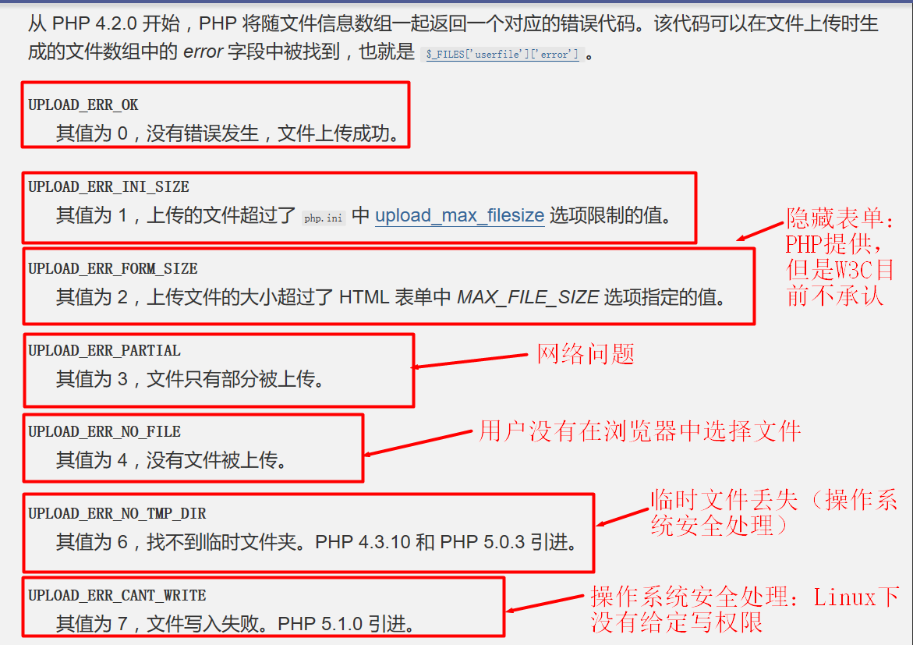

# **表单传值**	

> **思考**：Web2.0的显著特点信息共建，也就是用户可以将自己想要分享的数据提交给服务器端。但是用户能够看到的是最终的HTML呈现出来的效果，那么用户如何实现数据的提交呢？

> **引入**：用户是在体验终端浏览器端，那边能够被浏览器解析的只有HTML、CSS和JavaScript，而CSS是一种样式语言，是用来美化布局效果的，JavaScript也是一种动态效果语言，不能直接实现数据的交互。因此只有HTML本身可以实现数据的提交操作。而HTML中标签众多，也并非所有标签都能够进行数据提交，只有表单标签可以实现。

## **表单传值意义【掌握】**
> **定义**：表单传值，就是通过在HTML中使用表单标签，通过表单来获取用户的数据，然后通过HTTP协议将数据提交给后台。

1.表单传值的意义：表单传值能够帮助网站收集用户数据，实现用户与网站后台的数据交互。
2.表单传值方式：表单传值就是利用HTML的一组特点标签，然后通过浏览器解析后，给用户提供一种数据录入的入口，并且允许用户在数据录入后，实现数据提交。

> **总结**：表单传值是能够实现动态网站的非常重要的一步，不仅能够实现用户的数据提交，还能帮助用户实现动态的数据定制。

****

> **思考**：表单传值能够帮助用户实现数据提交，那么表单到底是用什么方式来提交给服务器的呢？

> **引入**：数据的提交本质是利用HTTP协议进行数据提交，而HTTP协议考虑到数据的安全性和多样性，也提供了多种数据提交规则。

## **表单传值方式【掌握】**
> **定义**：传值方式是HTTP协议根据动态网站的数据交互的要求，设定的一种传输规则。表单传值则是HTML根据HTTP传输协议而设定的自己的数据传输规则。在HTTP协议中，传输规则有6种：HEAD、GET、PUT、POST、DELETE和OPTIONS，而HTML的表单传值通常只用到2种，那就是GET和POST。

1.简单介绍HTTP协议的传输规则
* HEAD：通过发送HTTP请求来从服务器获取数据（不带任何数据，很少使用）
* GET：与HEAD一样，但是GET通常是通过自身携带数据来获取服务器数据
* PUT：指定服务器端存储位置来提交数据（HTML不支持）
* POST：直接提交数据给服务器
* DELETE：通过指定数据来删除服务器的数据（很少使用）
* OPTIONS：获取URL所支持的方法（极少使用）

2.表单传值方式：表单传值为了方便开发人员开发，通常只使用GET和POST两种方式来实现数据的提交    
* GET：显示的提交用户数据，通常开发人员认定此数据不会对后台数据产生改变，只会通过提交的数据来确定服务器要返回的数据	
* POST：隐式的提交用户数据，通常该类数据都是用来存储到后台数据库的

> **总结**：HTTP协议虽然提供了多种传输数据的方式，但是在Web的实际开发中，只用到了其中的GET和POST两种，因为这两种已经已经足够支撑Web开发中所需要的业务了。

****

> **思考**：Web开发中用到了GET和POST两种开发方式，那么这两种开发方式是如何在实际开发的时候实现的呢？

> **引入**：GET和POST这两种表单传值方式，有的时候是非常明显的体现，但是有的时候可能就是比较隐性的体现。比如说GET的方式就比较多，而POST方式就比较单一。

## **GET和POST传值实现【掌握】**
> **定义**：无论是GET还是POST都可以实现表单传值，但是彼此之间有方式区别，也有安全的区别，还有人为（开发者）的使用区别。不管是哪种方式，都是由开发人员确定，终端操作用户不能根据自己的想法来选择。

1.GET传值：GET传值是一种比较显性的数据传输方式，会在提交传输过程中，直接将数据添加到用户可见的URL之后。GET传值的方式有以下几种：
* a标签传输：直接在a标签中对应的href属性对应的链接中添加数据，数据的添加格式就是使用?将URL主体和数据分离，数据的绑定方式属于键值对，即：名字=值，如果是多个数据使用&符号分离

```HTML
<html>
<head></head>
<body>
<a href="http://www.taobao.com/index.php?keywords=笔记本&type=超极本">淘宝.笔记本.超极本</a>
<!--其中http://是协议，www.taobao.com属于主机地址，/index.php是URI，而?之后都是对应的数据：keywords和type都属于数据的名字，笔记本和超极本属于数据值，&符号代表多个数据的分隔符号-->
</body>
</html>
```
a标签的传输方式是GET方式传输的一种典型代表，几乎所有的GET方式传值都采用a标签方式。a标签的数据并非用户提交，而是由后台开发人员根据用户的需求，提前准备好    
* form标签：form标签是HTML中专门针对用户数据提交的一种表单，该表单允许会由开发人员提前准备好。form标签本身不做任何数据传输，而是靠form表单内部的其他数据表单来绑定数据，form表单可以批量进行数据传输

```HTML
<html>
<head></head>
<body>
<form action="请求脚本文件地址" method="GET">
<input type="text" name="keywords" value=""/>
<input type="text" name="type" value=""/>
<input type="submit" value="检索"/>
<!--
    form中action代表的本次提交的目标属性，即后台某个能够处理当前请求的PHP脚本；
    method是form的可改变属性，如果为GET那么意味着提交方式为GET传值，如果是POST那么就是POST传值；
    input为表单框，type确定表单元素的操作属性，text表明是文本输入，submit为提交动作，name作为提交的必须属性代表提交给后台数据对应的数据名字，value代表数据值，用户输入的那么可以为空，由用户输入数据
-->
</form>
</body>
</html>
```
form表单是一种标准数据提交方式，可选GET方式还是POST方式，由开发人员根据当前数据的类型和数据的安全性来确定。通常如果是需要用户进行数据写入的时候就会使用到form表单，form表单不限定数据数量    
* location对象的href属性：location是window对象的一个属性，是用来包含当前窗口对应的url信息，但是同时该属性本身还有一个href属性，可以用来动态的改变窗口对应的url，这个时候需要利用事件

```HTML
<html>
<head></head>
<body>
<input type="button" value="获取当前URL" onclick="alert(window.location)"/>
<!--window.location会得到当前的URL-->
<input type="button" value="改变当前URL" onClick="window.location.href='http://www.baidu.com/index.php?search=电脑'"/>
<!--window.location.href会在触发后进入到指定的url地址-->
</body>
</html>
```
window.location.href这个在实际开发中会更多应用于事件操作。即用户在做某些指定操作的时候，可以进行页面的跳转
* location对象的assign()方法：assign()方法与href属性相似，都是需要通过事件操作来设定某些触发点，然后用户触发后执行对应的窗口跳转

```HTML
<html>
<head></head>
<body>
<input type="button" value="改变当前URL" onClick="window.location.assign('http://www.baidu.com/index.php?search=电脑')"/>
<!--window.location.href会在触发后进入到指定的url地址-->
</body>
</html>
```
window.location.assign()的本质与href属性一样，就是改变当前窗口的URL，其操作方式也是通过事件触发    
2.POST传值：POST传值是一种比较隐性的传值方式，一般用户无法直观的看到传输的数据，POST传值方式比较单一，就是通过Form表单进行传值，同时在method属性中使用POST方式即可
```HTML
<html>
<head></head>
<body>
<form action="请求脚本文件地址" method="POST">
<input type="text" name="keywords" value=""/>
<input type="text" name="type" value=""/>
<input type="submit" value="检索"/>
</form>
</body>
</html>
```
3.GET与POST的区别：GET和POST没有本质的区别，都可以实现数据从浏览器端传输到服务器端
* 目标用途区别：GET主要用来获取服务器数据，提供的是一些数据信息片段，服务器通过数据片段获取数据；POST主要用来提交数据，即数据最终会实现数据库的数据变更
* 实现方式区别：GET可以使用URL、form表单和window.location来实现（本质还是URL），而POST只能通过form表单实现
* 执行效果区别：GET传值在提交时数据通常会在浏览器地址栏中显示，而POST不会显示（所以POST安全性比GET高）
* 传输大小区别：理论上来讲GET和POST没有区别（HTTP协议没有规定），但是浏览器通常在GET上做了限制，不同浏览器限制的大小不一样，IE为2K，而POST依然没有限制

> **总结**：在Web开发中，通常使用HTTP协议中的GET和POST来实现用户数据提交，GET和POST的应用有所区别，需要程序员根据实际需求、内容和安全性等来选择对应的方式。通常查看、删除数据使用GET方式，新增和修改使用POST方式。

****

> **思考**：浏览器提交数据，其实还是服务器给用户做好的，只是用户根据具体数据需求来选择是点击、选择还是输入。那么当用户把数据提交了以后，服务器端怎么处理呢？

> **引入**：服务器端Apache是无法去获取用户提交的数据的，这些数据需要PHP来接收处理。而PHP默认就考虑到了实际开发的需求，因此提供了一些预定义变量（系统变量）来自动接收数据。

## **PHP接收数据【掌握】**
> **定义**：PHP接收数据，其实就是根据HTTP协议的特点，将用户按照HTTP协议提交的数据取出来存放到不同的容器（预定义变量）中，从而能够方便开发者直接使用这些接收的数据。    

1.在PHP中，为开发者提供了三种数据接收的方式，分别是：
* $_GET：接收用户GET方式提交的数据
* $_POST：接收用户POST方式提交的数据
* $_REQUEST：接收用户GET和POST提交的数据

2.$_GET：专用于接收GET方式提交的数据，是一个超全局预定义数组，表单名字作为数组下标，表单值作为数组元素值
```PHP
用户提交数据的HTML文件
<html>
<head></head>
<body>
<a href="http://www.taobao.com/index.php?keywords=笔记本&type=超极本">淘宝.笔记本.超极本</a>
</body>
</html>

服务器接收数据的index.php文件
<?php
//输出关键字和类型
echo $_GET['keywords'];        //笔记本
echo $_GET['type'];            //超极本
?>
```
3.$_POST：专用于接收POST方式提交的数据，与$_GET形式一样
```PHP
用户提交数据的HTML文件：用户输入笔记本和超极本数据提交
<html>
<head></head>
<body>
<form action="index.php" method="POST">
<input type="text" name="keywords" value=""/>
<input type="text" name="type" value=""/>
<input type="submit" value="检索"/>
</form>
</body>
</html>

服务器接收数据的index.php文件
<?php
//输出数据
echo $_POST['keywords'];        //笔记本
echo $_GET['type'];             //超极本
?>
```
4.$_REQUEST：接收用户使用GET和POST方式提交的数据，但是因为PHP数组下标具有唯一性，如果GET和POST方式各有一个同名数据，那么默认POST会覆盖GET（通常不会同时出现GET和POST），也正是因为会存在数据覆盖的情况，所以开发人员通常会明确到底是GET还是POST，只是在有的数据来源可能有多方面的时候会使用$_REQUEST
```PHP
用户提交数据的HTML文件：用户输入笔记本和超极本数据提交
<html>
<head></head>
<body>
<form action="index.php?keywords=娃娃" method="POST">
<input type="text" name="keywords" value=""/>
<input type="text" name="type" value=""/>
<input type="submit" value="检索"/>
</form>
</body>
</html>

服务器接收数据的index.php文件
<?php
//输出数据：POST
echo $_POST['keywords'];        //笔记本
echo $_POST['type'];             //超极本

//输出数据：GET
echo $_GET['keywords'];         //娃娃
echo $_GET['type'];             //错误：没有该元素

//输出数据：REQUEST
echo $_REQUEST['keywords'];     //笔记本
echo $_REQUEST['type'];         //超极本
?>
```
5.练习：制作一个验证用户登录的简易表单，然后在后台实现数据的接收与验证（后台固定用户名和密码：密码MD5加密）

> **总结**：实际开发中，开发人员是可以明确控制用户数据的提交方式的，因此在后台也会明确获取数据的方式$_GET和$_POST，但是也会有特定情况下数据的来源不够明确，因此要用到$_REQUEST来接收数据。

****

> **思考**：在实际开发中，有些需求会涉及到用户的多数据提交，比如单选框和复选框之类的，那么这类数据也是像普通表单一样处理吗？

> **引入**：本质上来讲，如果这类复合表单数据也可以采用同样的方式来提交数据和接收数据。但是如果一旦按照普通方式来处理，意味着可扩展性会变得很差，因此会针对这类需求进行特殊处理。

## **复合表单提交【掌握】**
> **定义**：复合表单是一类比较特殊的表单，包括单选框和复选框，这类对应的实际表单数据比较多（通常不止一个），而代表的数据通常是单一的，因此在这类处理的时候，通常为了方便操作，前后台都会设置一个唯一的名字来进行规范

1.单选框操作：单选框即给用户提供多个选择，但是用户只能选择一个结果。即用户表单有多个，但是最终提交给服务器的永远只有一个。这类表单的处理方式比较简单：表单多个，但是名字一致，后台只需要接收一个结果。
```PHP
单选框表单：一个名字，多个单选框表单
<html>
<head></head>
<body>
<form action="index.php" method="POST">
<input type="radio" name="gender" value="男"/>
<input type="radio" name="gender" value="女"/>
<input type="radio" name="gender" value="保密"/>
<input type="submit" value="提交"/>
</form>
</body>
</html>

服务器接收数据的index.php文件
<?php
//输出接收结果
echo $_POST['gender'];            //用户选中的一个具体值
?>
```
2.复选框操作：复选框同样也是给定用户多个选中，而且用户也可以选中多个结果。这个时候就比较麻烦了，因为如果同名，PHP接收的时候会覆盖同名表单，那么最终后台只能保留一个用户选择。为了解决这个矛盾，就要利用HTML表单不识别[]而PHP会自动识别[]为数组的特性。
```PHP
复选框表单：一个名字+[]，多个复选框表单
<html>
<head></head>
<body>
<form action="index.php" method="POST">
<input type="checkbox" name="hobby[]" value="篮球"/>
<input type="checkbox" name="hobby[]" value="足球"/>
<input type="checkbox" name="hobby[]" value="台球"/>
<input type="checkbox" name="hobby[]" value="乒乓球"/>
<input type="checkbox" name="hobby[]" value="羽毛球"/>
<input type="checkbox" name="hobby[]" value="排球"/>
<input type="submit" value="提交"/>
</form>
</body>
</html>

服务器接收数据的index.php文件
<?php
//输出接收结果：$_POST接收到hobby[]变成$_POST[hobby[]]，从而最终转变成$_POST[hobby][]
var_dump($_POST['hobby']);            //array+具体元素个数
?>
```
3.数据回显：很多时候，会涉及到数据编辑，这个时候就需要将用户原来保存的数据在用户进行编辑前显示给用户。显示的方式通常也是以对应的复合表单方式显示。其实复合表单回显就是被选中，在HTML中提供了对应选中属性：checked="checked"
```PHP
<?php
//获取用户原来的数据：假定从数据库获取
$gender = '男';
$hobby = ['篮球','乒乓球','羽毛球'];
?>

<!--HTML中显示数据-->
<html>
<head></head>
<body>
<form action="index.php" method="POST">
<!--单选框后台只保留一个值，所以直接比较即可：成功后输出checked="checked"-->
<input type="radio" name="gender" <?php echo $gender == '男' ? 'checked="checked"' : '';?> value="男"/>
<input type="radio" name="gender" <?php echo $gender == '女' ? 'checked="checked"' : '';?> value="女"/>
<input type="radio" name="gender" <?php echo $gender == '保密' ? 'checked="checked"' : '';?> value="保密"/>

<!--复选框后台保留的是数组，所以要采用存在判定-->
<input type="checkbox" name="hobby[]" <?php echo in_array('篮球',$hobby) ? 'checked="checked"' : '';?> value="篮球"/>
<input type="checkbox" name="hobby[]" <?php echo in_array('篮球',$hobby) ? 'checked="checked"' : '';?> value="足球"/>
<input type="checkbox" name="hobby[]" <?php echo in_array('篮球',$hobby) ? 'checked="checked"' : '';?> value="台球"/>
<input type="checkbox" name="hobby[]" <?php echo in_array('篮球',$hobby) ? 'checked="checked"' : '';?> value="乒乓球"/>
<input type="checkbox" name="hobby[]" <?php echo in_array('篮球',$hobby) ? 'checked="checked"' : '';?> value="羽毛球"/>
<input type="checkbox" name="hobby[]" <?php echo in_array('篮球',$hobby) ? 'checked="checked"' : '';?> value="排球"/>
<input type="submit" value="提交修改"/>
</form>
</body>
</html>
```

4.练习：同时使用单选框和复选框制作一个用户基本信息收集表单，然后在后台接收数据并进行展示

> **总结**：单选框和复选框这类复合表单要根据实际需求来设定表单、接收数据以及存储数据，其实本质原因是为了良好的可扩展性（如复选框要增加一个元素只需要修改表单，不需要修改PHP代码和数据库设计）。而这种特性利用的就是单选框的唯一性和复选框的[]不识别特性（PHP识别特性）。

****

> **思考**：文件上传的时候是不是也是给用户提供对应的表单，然后后台用$_POST或者$_GET去接收操作呢？

> **引入**：文件上传的操作比较复杂，不是简单的上传-接收过程。因为接收文件是需要利用到操作系统来实现的，同时文件对应的信息也比较多，需要使用特定的方式来接收处理。

## **文件上传操作【掌握】**
> **定义**：文件上传，是指给定用户提供文件上传表单，用户将文件从本机电脑上传到服务器的过程，而且这个过程需要借助操作系统作为中间媒介来完成。

1.制作文件上传表单：文件上传表单理论上只需要借助于input标签中的file类型来实现，且表单必须为post方式上传（文件通常比较大）。但是还有一个特殊问题，就是文件是二进制的不是普通字符流，所以需要明确告知HTTP协议使用到了文件上传，这时需要在表单form中使用属性enctype，enctype是关于表单内容处理的属性：
* enctype='application/x-www-form-urlencoded'，默认属性值，表示在发送前对所有特殊字符进行编码（对应ASCII）
* enctype='multipart/form-data'，表示不对数据进行编码（二进制不用编码）
* enctype="text/plain"，只对空格进行转换，变成“+”，其他不编码

```HTML
<html>
<head></head>
<body>
<form action="处理文件上传的PHP文件" method="POST" enctype="multipart/form-data">
<input type="file" name="file" value=""/>
<!--name属性为后台接收名字，value可以为空-->
<input type="submit" name="submit" value="上传"/>
</form>
</body>
</html>
```
2.PHP接收：默认的如果不使用enctype属性，那么文件上传是伪成功的：即PHP可以使用$_POST接收到该表单，但是仅仅是表单的名字和文件的名字而已，不是真正的文件上传。一旦加上enctype属性，可以使用$_FILES来接收文件
```PHP
<?php
//取出文件
$file = $_FILES['file'];        //file下标为表单中name属性的值
?>
```
3.文件上传后，在PHP端会保存文件的5个信息
* name：文件在客户端本地的文件名字
* type：文件的类型（MIME类型：多功能互联网邮件扩展）
* tmp_name：文件在服务器端操作系统接收后保存的临时文件名字：默认是操作系统的临时文件存储目录（可以通过PHP配置文件修改）
* error：错误代码

* size：文件大小（字节）

4.文件是操作系统临时接收的，保存在临时文件中。PHP如果不处理，那么操作系统就会认为数据没有意义，自动清除。因此PHP需要将临时文件进行目标转移，转移到指定位置，使用函数：move_uploaded_file(临时文件路径,目标存储位置)，目标存储位置需要重命名（默认临时文件名字为tmp）
```PHP
<?php
//取出文件
$file = $_FILES['file']; 

//简单判定
if($file['error'] == 0){
    //移动文件
    move_uploaded_file($file['tmp_name'],'目标位置目标文件');
}
?>
```
5.文件是一种外部来源数据，PHP要不信任任何外来数据。因此PHP在进行文件操作的时候一定要进行安全判定。而文件上传通常是一种比较统一形式的方式，因此可以采用封装函数来实现文件上传。
```PHP
<?php
//封装上传文件的函数
//1.明确上传函数可能变换的内容：文件来源，文件保存位置，文件大小（业务规范），文件类型（MIME类型：后缀名可以改）。明确后作为参数传入
//2.明确要返回的结果：出错返回false，成功返回路径（错误信息通过参数外传）
function uploadFile($file,$save_path,&$error,$type = array(),$max = 2000000){
    //默认类型不限定，默认大小为2M
    
    //3.判定文件本身的错误信息
    if(isset($file['error'])){
        //确保是有效文件上传
        switch($file['error']){
            case 1:
                $error = '文件超过服务器允许大小！';
                return false;    //直接使用return结束函数
            case 2:
                $error = '文件超过表单允许大小！';
                return false;    
            case 3:
                $error = '文件只上传一部分！';
                return false; 
            case 4:
                $error = '没有选中要上传的文件！';
                return false; 
            case 6:
            case 7:
                //case 6没有内容，表明继续执行case 7代码
                $error = '服务器操作失败！';
                return false; 
        }
    }
    
    //4.判断文件业务需求：类型匹配
    if(!empty($type) && !in_array($file['type'],$type)){
        //类型需求不为空且当前文档类型不在需求中：不满足条件
        $error = '当前文件的类型不匹配';
        return false;
    }
    
    //5.判断文件业务需求：大小匹配（当前业务文件大小）
    if($file['size'] > $max){
        $error = '当前文件过大！';
        return false;
    }
    
    //6.没有问题上传文件：保存判定（权限问题）
    if(move_uploaded_file($file['tmp_name'],$save_path . '/' . $file['name'])){
        //保存成功：返回最终名字
        return $file['name'];
    }else{
        //保存失败
        $error = '文件保存失败！';
        return false;
    }
}

?>
```
6.练习：封装文件上传函数，然后利用文件上传函数实现文件上传

> **总结**：文件上传是Web开发中很重要的一个功能，几乎所有涉及用户管理的网站，都会用到文件上传功能。而这项功能本身并不复杂，只有三个部分：用户选择文件上传（表单）-》PHP判定文件安全（$_FILES判定）-》文件移动保存（save_uploaded_file）

****

> **思考**：在很多网站中，都会看到有文件上传的功能，很多的时候可能要一次性操作很多文件，这个时候该怎么处理呢？

> **引入**：文件上传理论上只是一个一个上传，所谓的批量上传到了服务器端也是一个一个上传的，只是用户的感觉是一次性上传多个的。不过在多文件上传的时候，也会涉及到两种不同的需求。

## **多文件上传【掌握】**
> **定义**：所谓多文件上传，只是从用户的角度进行一次性多个文件上传而已。但是后台的本质依然是一个文件一个文件的上传，但是因为PHP效率问题，用户感觉不到什么延迟效果。

1.多文件上传根据上传文件的方式有两种分别：
* 有多处需要文件上传，而每个文件之间没有什么关联，这类的本质依然单文件上传

```HTML
<html>
<head></head>
<body>
<form action="处理文件上传的PHP文件" method="POST" enctype="multipart/form-data">
头像：<input type="file" name="head_img" value=""/>
身份证正面照：<input type="file" name="id_img1" value=""/>
身份证反面照：<input type="file" name="id_img2" value=""/>
<input type="submit" name="submit" value="上传"/>
</form>
</body>
</html>
```
* 在同一个地方需要有多个文件上传，多个文件属于同一类文件，需要共同管理：这类表单利用的与复选框命名方式类似

```HTML
<html>
<head></head>
<body>
<form action="处理文件上传的PHP文件" method="POST" enctype="multipart/form-data">
个人相册：
<input type="file" name="photo[]" value=""/>
<input type="file" name="photo[]" value=""/>
<input type="file" name="photo[]" value=""/>
<input type="submit" name="submit" value="上传"/>
</form>
</body>
</html>
```
2.多文件后台PHP处理
* 对于多个单文件上传，后台可以直接利用已经封装好的文件上传函数多次调用即可

```PHP
<?php
//循环调用函数：因为一个文件就会在$_FILES中形成一个元素
foreach($_FILES as $file){
    //$file就是每一个元素：对应一个上传文件的5要素
    $res = uploadFile($file,'文件保存路径',$error);
    if($res === false){
        //上传失败
        exit($error);
    }
        
    //提升上传成功
    echo "文件：" . $file['name'] . ' 上传成功！';

}
?>
```
* 对于同名多文件上传，那么$_FILES接收的数据是生成5个元素的二维数组，因此需要将每个文件的5个要素取出来独立成一个文件信息，然后使用单文件上传即可。

```PHP
<?php
//通过任意一个要素长度来进行循环
for($i = 0,$len = count($_FILES['photo']['error']);$i < $len;$i++){
    //因为同名元素长传，导致的结果是error\name\size\tmp_name\type都各自形成一个索引数组
    //构造每个文件信息：关联数组
    $file = array(
        'name' => $_FILES['photo']['name'][$i],
        'type' => $_FILES['photo']['type'][$i],
        'tmp_name' => $_FILES['photo']['tmp_name'][$i],
        'error' => $_FILES['photo']['error'][$i],
        'size' => $_FILES['photo']['size'][$i]
    );
    
    //调用文件上传
    uploadFile($file,'文件上传路径',$error);
}
?>
```
3.练习：制作一个单文件上传函数，也制作一个多文件上传函数，使用多文件上传函数调用单文件函数上传，最终实现多文件上传。

> **总结**：文件上传是Web开发中必不可少的一个需求，文件上传要后台把控的地方比较多，需要注意每一个细节的验证，保证服务器的安全。多文件上传最终其实也是归属到单文件上传，要掌握多文件上传的细节，然后转换成单文件上传即可。